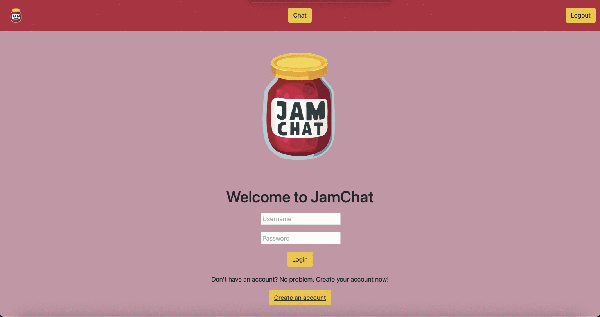

# JAMChat

## Description

Global chat application where users can talk about any subject.

## Motivation

We were motivated by facebook’s ability to connect with others globally but the simplicity of the slack so we wanted to combine a simple chat application connecting people around the world.

### Table of Contents

* [Installation](#installation)

* [Demo](#demo)

* [License](#license)

* [Contact](#contact)

* [Links](#links)

## Installation

Deployed to Heroku

## Demo

## License

This project is licensed under the MIT License.
Click [Link](https://choosealicense.com/licenses/mit/) for more information.

## Contact

Juan Sanchez

[Github Profile](https://github.com/karizmatik215)

juan.sanchez@phila.gov

Alex Chisar

[Github Profile](https://github.com/Arivas00)

a.chisar00@gmail.com

Mohammad Rouf

[Github Profile](https://github.com/mrouf82)

mrouf82@gmail.com

## Links

[JamChat Repository](https://github.com/Arivas00/JAMChat)

[JamChat User Workflow](https://docs.google.com/document/d/1fQLXkvS7oQ8BPgvhloA0_IRQSUBL0_pSvyhKCAf4EbI/edit?ts=60625ff4)

[JamChat Presentation](https://docs.google.com/presentation/d/1wINoc51DG0HzBdhsjOuFsqTMqFM9qHN14n4eD1bQtc4/edit?usp=sharing)
